# STM32F0_Setup_LedCtrl
Implemented on STM32F072C8T6.

## Hardware setup
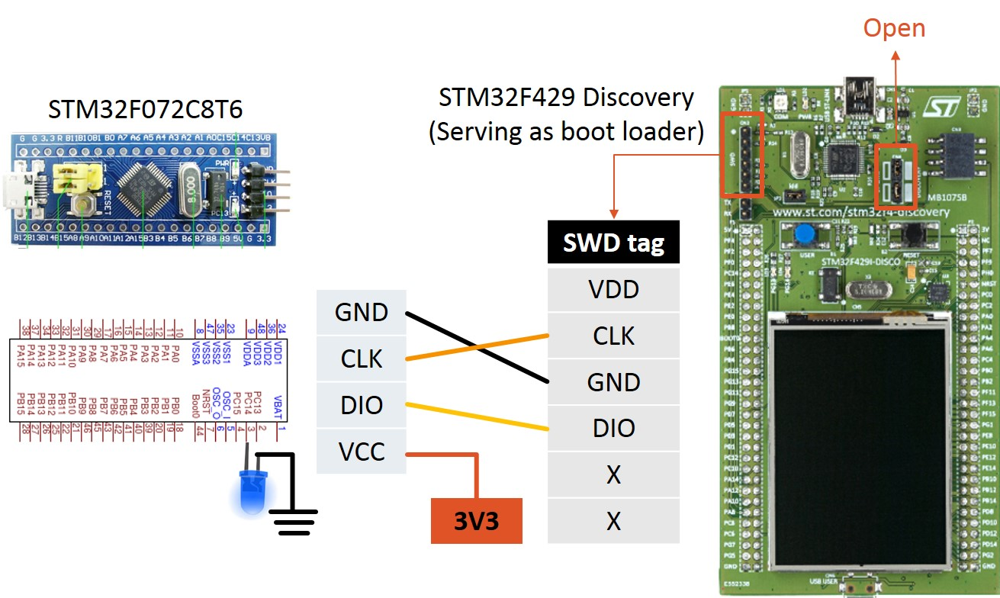
  
An STM32F429I-Discovery board (with STM32F429ZIT core) serves as flash loader.  
The SWD tag is connected to that of the STM32F072C8T6 as shown in diagram above.  
VCC of the latter should be connected to 3V3 instead of 5V, else flashing might fail.  
Connect the LED to pin C14.  
  
## Software downloads
- MDK-Arm & Keil uVision  
We download and install MDK-Arm from official website, the Keil uVision IDE would be installed as well.   
https://www.keil.com/download/product/  

## Firmware downloads
- Firmware package for stm32f0 series (cmsis, peripheral libraries, ...)  
http://www.st.com/en/embedded-software/stm32cubef0.html  

- ST-Link debugger  
http://www.st.com/content/st_com/en/products/development-tools/hardware-development-tools/development-tool-hardware-for-mcus/debug-hardware-for-mcus/debug-hardware-for-stm32-mcus/st-link-v2.html  

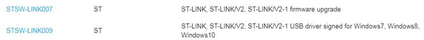  
  
## Project setup
### Generate uVision Project
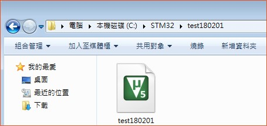  
  
Here we generate a project directory, containing the uVision project file, libraries, build files, etc.  
>Project > New uVision Project
Create project directory > create uVision project file  
  
 
### Select device
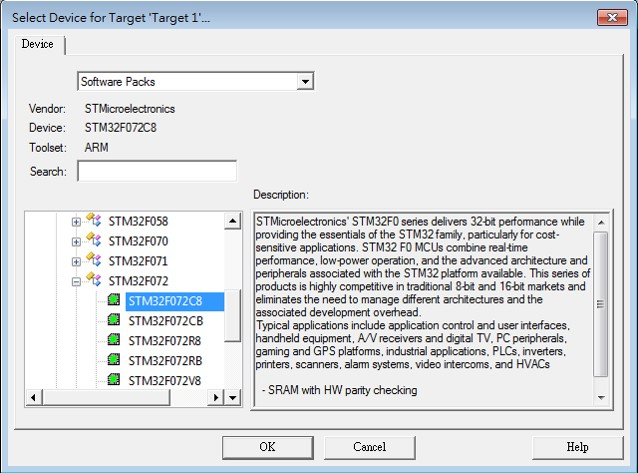  
Select corresponding device.  
>STMicroelectronics > STM32F072 > STM32F072C8
  
 
### Categorize files
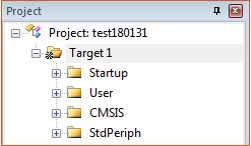  
>Target 1 > [Right click] > Add group
- Startup (click twice to rename 1st one): contains startup file(*.s).
- User: contains user-generated source files & header files.
- CMSIS: contains system files.
- StdPeriph: contains peripheral library includes.

### Download peripheral libraries
- Download from official website:   
http://www.st.com/content/st_com/en/products/embedded-software/mcus-embedded-software/stm32-embedded-software/stm32-standard-peripheral-libraries/stsw-stm32048.html  

- Extract archive.  

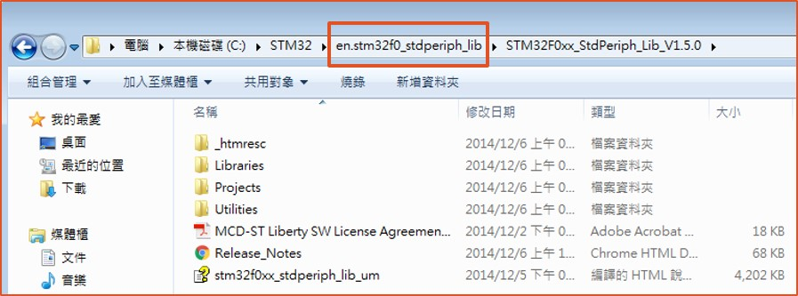  

### Include peripheral libraries
>Archive > Libraries > copy CMSIS and STM32F0xx_StdPeriph_Driver  

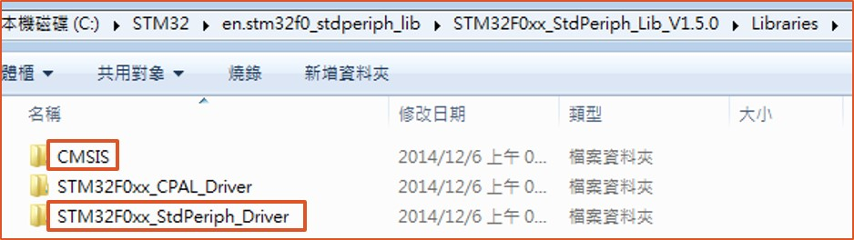  

>cd Project directory > paste  

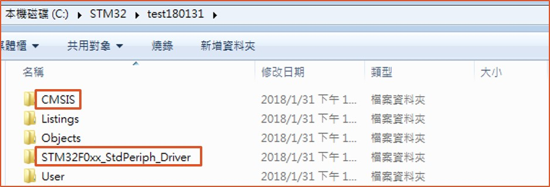  

### Add source files (*.c)
- Startup group  
>cp .\CMSIS\Device\ST\STM32F0xx\Source\Templates\arm\startup_stm32f072.s (project_directory)  
>click on 'Startup' > add existing item  
- User group  
>click on 'User' > add new item > c source file (main.c)  
- CMSIS group  
>add existing item > .\CMSIS\Device\ST\STM32F0xx\Source\Templates\system_stm32f0xx.c  
- StdPeriph group  
Here we add all required c source files in current project.  
For example, 'misc.c', 'rcc.c', and 'gpio.c'.  
>add existing item > .\STM32F0xx_StdPeriph_Driver\src\XXXX.c  

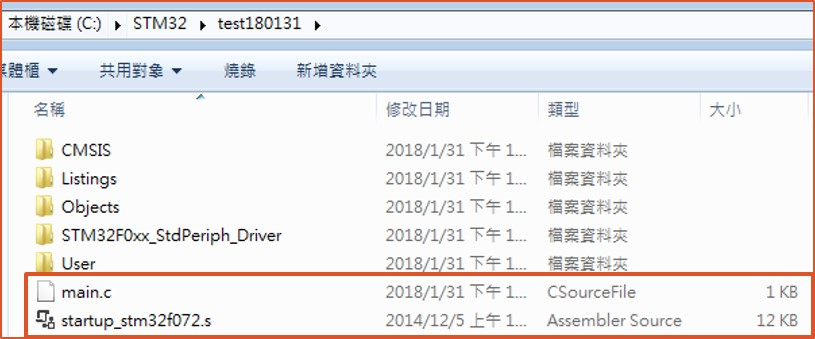  

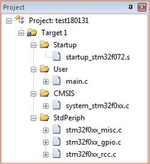  

### Include conf.h
Search for 'stm32f0xx_conf.h' in ORIGINAL ARCHIVE\Projects\STM32F0xx_StdPeriph_Examples folder.  

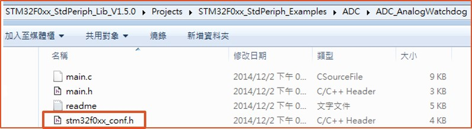  

Copy random one as a template and paste it to StdPeriph driver subfolder of current project.   

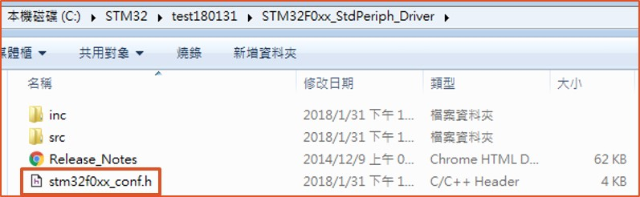  

### Setup preprocessor & include paths
- Define preprocessor  
>Flash > Configure flash tools > [tab] C/C++  
>[Prepressor symbols] Define: USE_STD_PERIPH_DRIVER  

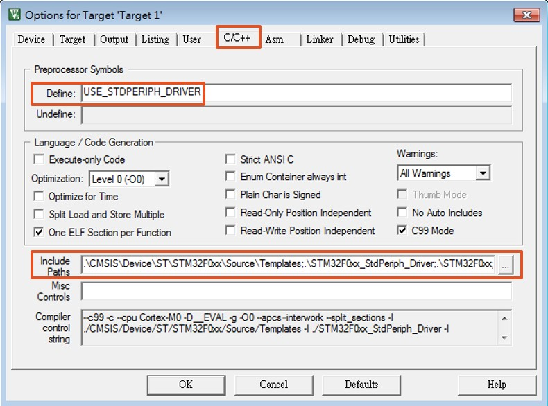  

- Configure include paths
>[Include paths] click on [...]  

Set include paths as shown in following screenshot.  

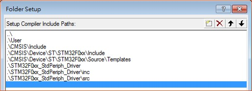  

Details of each path are listed in following table:   

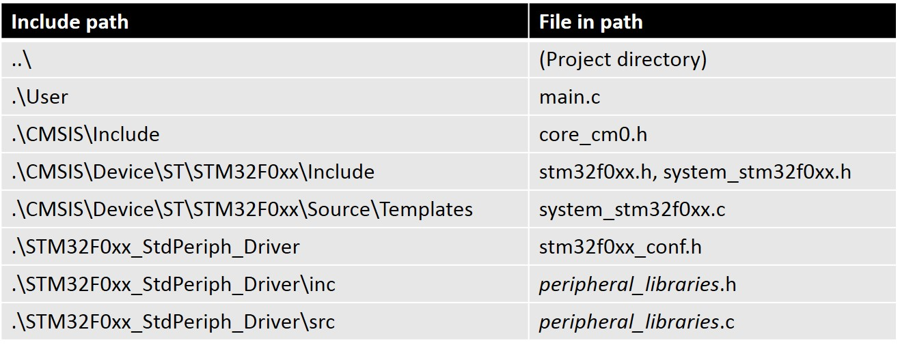  

### Modify header files (*.h)
- stm32f0xx.h  
>stm32f0xx.h > [Right click] Properties > disable "read-only" and apply

Open stm32f0xx.h in the IDE and uncomment following (also shown in screenshot below):
>#define STM32F072 (or whichever that matches your device)  
>#define USE_STDPERIPH_DRIVER  

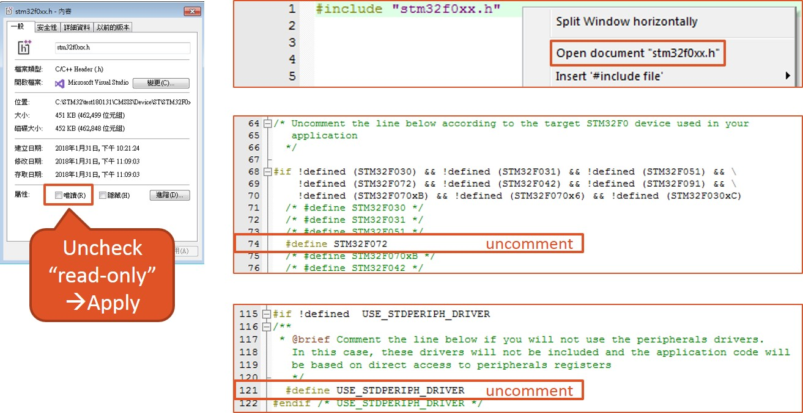  

- stm32f0xx_conf.h  
Open file in IDE and uncomment the header files we wish to include in our project.  

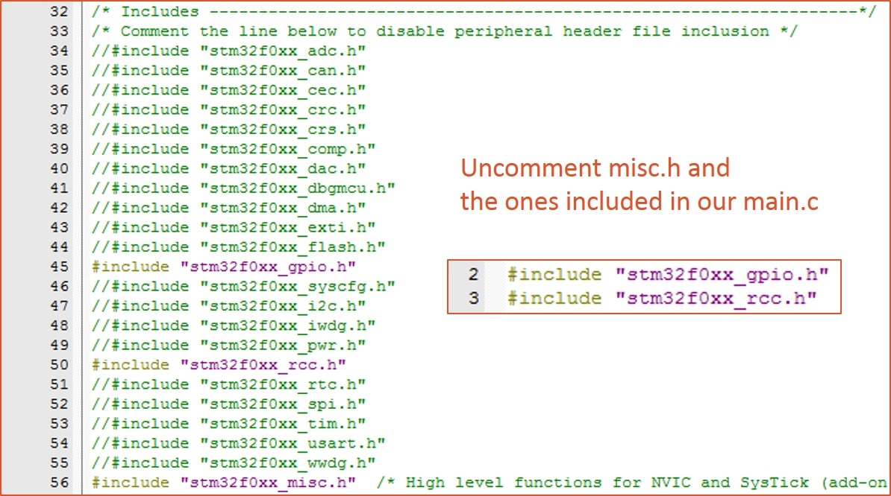  
 
### Modify target flash options
>Flash > Configure flash tools > Debug  
>Select ST-Link Debugger  
>Click on [Settings]  

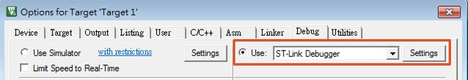  

- [Debug] tab   
>[Unit]: ST-LINK/V2  
>[port]: SW  

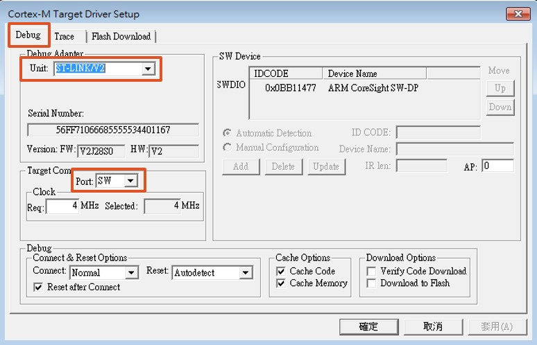  

- [Flash download] tab   
>[Reset and run]: enable  
>[Programming Algorithm]: add settings as shown in following screenshot.  

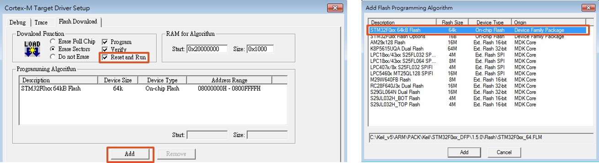  

## Run example code
Finally we can test the example code (main.c) provided in this repo.  
>F7 (Build target)  
>F8 (Download)  

Good luck! :)

## REFERENCES
https://www.youtube.com/watch?v=_QXoTNP9GIw  
http://www.electronics-homemade.com/STM32F4-SettingUp-FirstProject-stm32f4.html  
